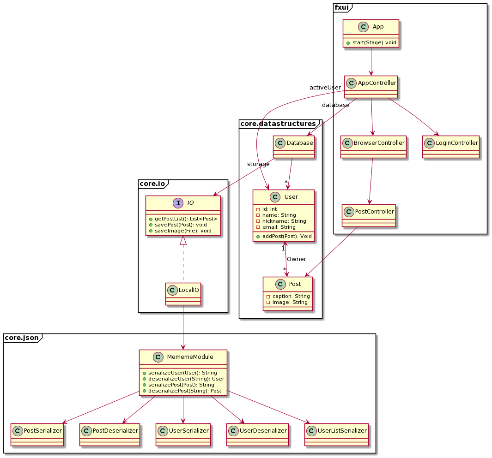

# MEMEMEMDB

MEMEMEDB is a meme sharing application.
With this application users may view, share, post and comment on memes.
A meme consists of a picture and a caption,
and users may add comments to the posted meme.

## Code Organization

The code is organized by component,
and has the following directory structure:

* **`src/mememedb/`** - contains the main code
* **`src/mememedb/<component>`** - each subcomponent (e.g json) has its own folder
* **`src/resources/`** - contains images etc.
* **`test/mememedb/`** - contains the tests

The following class diagram shows the outline of the code structure:

## User Story
I want to be able to post a picture to the app, and see it appear on the main page

## Maven Goals

* `validate` - Validate the project is correct
and all necessary information is available.
* `compile` - Compile the source code of the project.
* `test` - Test the compiled source code.
* `verify` - Run any checks on results of integration tests
to ensure quality criteria are met.
The goal `jacoco:check` runs as part of this goal.
* `jacoco:check` - Checks that the code coverage metrics are being met.
* `jacoco:report` - Generates test coverage report to `target/site/jacoco`.
* `javafx:run` - Run the javafx app.
